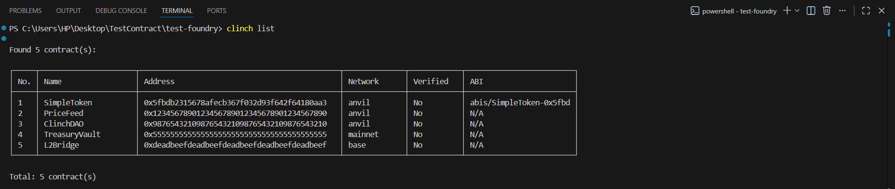
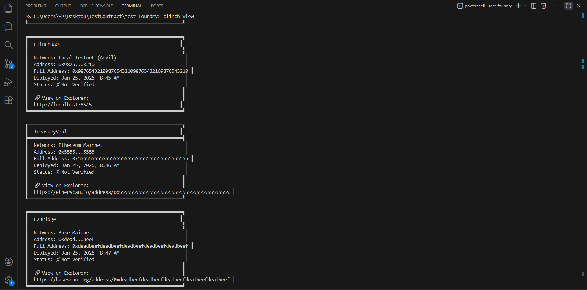

# Clinch

**Smart contract registry for Foundry projects**

Clinch is a CLI tool that helps you and your team manage deployed smart contracts across multiple networks. Automatically sync deployments from Foundry, track contract addresses, and share deployment info via Git.

[](https://opensource.org/licenses/MIT)
[](https://github.com/yourusername/clinch)

---

## 📋 Table of Contents

- [Features](#features)
- [Installation](#installation)
- [Quick Start](#quick-start)
- [Commands](#commands)
  - [Initialize](#initialize)
  - [Sync from Foundry](#sync-from-foundry)
  - [Manual Add](#manual-add)
  - [List Contracts](#list-contracts)
  - [View Contracts (User-Friendly)](#view-contracts-user-friendly)
  - [Show Contract Details](#show-contract-details)
  - [Search/Find](#searchfind)
  - [Update Contract](#update-contract)
  - [Delete Contract](#delete-contract)
  - [Networks Overview](#networks-overview)
- [Git Integration](#git-integration)
- [Team Collaboration](#team-collaboration)
- [Project Structure](#project-structure)
- [Use Cases](#use-cases)
- [Troubleshooting](#troubleshooting)
- [Contributing](#contributing)
- [License](#license)

---


## ✨ Features

- **Auto-sync from Foundry** - Detects and imports deployments automatically
- **Project-specific registry** - Each Foundry project gets its own `.clinch/` folder
- **Multi-network support** - Track contracts across mainnet, testnets, and local networks
- **Git automation** - Optional auto-commit and push to share with your team
- **Smart search** - Find contracts by name, address, or network
- **Multiple views** - Table format for devs, card format for non-technical users
- **Security checks** - Prevents accidental private key exposure
- **ABI management** - Automatically captures and stores contract ABIs

---

## 📦 Installation

### Global Installation (Recommended)

```bash
npm install -g clinch-cli
```

### Local Installation (Per Project)

```bash
npm install clinch-cli
```

### From Source

```bash
git clone https://github.com/yourusername/clinch-cli.git
cd clinch-cli
npm install
npm link
```

### Verify Installation

```bash
clinch --version
```

---

## 🚀 Quick Start

### 1. Initialize Clinch in Your Foundry Project

```bash
cd your-foundry-project
clinch init
```

This creates a `.clinch/` folder with:

- `contracts.json` - Your contract registry
- `abis/` - Stored contract ABIs

### 2. Deploy with Foundry

```bash
forge script script/Deploy.s.sol --rpc-url sepolia --broadcast
```

### 3. Sync the Deployment

```bash
# Auto-detect and sync
clinch sync

# Sync and push to GitHub
clinch sync --git
```

### 4. View Your Contracts

```bash
# Developer view (table)
clinch list
**Output:**



# User-friendly view (cards)
clinch view
```

**Output:**



**That's it!** Your contracts are now tracked and ready to share with your team.

---

## 📖 Commands

### Initialize

**Create `.clinch/` registry in your Foundry project**

```bash
clinch init
```

**Output:**

```
Clinch initialized successfully!
Registry location: /path/to/project/.clinch

Next steps:
  1. Deploy contracts with Foundry
  2. Run: clinch sync
  3. Commit .clinch/ to Git to share with your team
```

**What it does:**

- Creates `.clinch/` folder in current directory
- Creates `contracts.json` (empty registry)
- Creates `abis/` folder for ABI storage

---

### Sync from Foundry

**Automatically import deployments from Foundry broadcast files**

```bash
# Auto-detect latest deployment
clinch sync

# Specify broadcast file manually
clinch sync -b broadcast/Deploy.s.sol/31337/run-latest.json

# Sync and push to GitHub
clinch sync --git
```

**What it does:**

1. Finds latest `run-latest.json` in `broadcast/` folder
2. Extracts deployed contracts (CREATE transactions)
3. Fetches ABIs from `out/` directory
4. Saves contracts to `.clinch/contracts.json`
5. Optionally commits and pushes to Git (with `--git` flag)

**Example output:**

```
📍 CLI is currently looking at: /home/user/my-project
🔍 Syncing from Foundry broadcast...
 Synced: SimpleToken (anvil)
 Synced: NFTContract (anvil)

 Sync complete! Added 2 contract(s).

✅ Changes committed locally
💡 Tip: Use --git flag to also push to GitHub
```

---

### Manual Add

**Add a contract manually (useful for external contracts)**

```bash
clinch add <name> <address> <network> [options]
```

**Options:**

- `-a, --abi <path>` - Path to ABI file
- `-v, --verified` - Mark contract as verified

**Examples:**

```bash
# Basic add
clinch add USDC 0xA0b86991c6218b36c1d19D4a2e9Eb0cE3606eB48 mainnet

# Add with ABI
clinch add MyToken 0x123...abc sepolia --abi ./out/MyToken.sol/MyToken.json

# Add verified contract
clinch add WETH 0xC02aaA39b223FE8D0A0e5C4F27eAD9083C756Cc2 mainnet --verified
```

**Features:**

- **Duplicate detection** - Won't allow duplicate names
- **Alias support** - Same address can have multiple names
- **Address validation** - Checks for valid Ethereum address format

---

### List Contracts

**View all contracts in table format (developer view)**

```bash
clinch list [options]
```

**Options:**

- `-n, --network <network>` - Filter by network
- `-v, --verified` - Show only verified contracts

**Examples:**

```bash
# List all contracts
clinch list

# List only Sepolia contracts
clinch list --network sepolia

# List only verified contracts
clinch list --verified
```

**Output:**

```
Found 3 contract(s):

┌─────┬──────────────────────┬──────────────────────────────────────────────┬──────────────┬────────────┬─────────────────────────┐
│ No. │ Name                 │ Address                                      │ Network      │ Verified   │ ABI                     │
├─────┼──────────────────────┼──────────────────────────────────────────────┼──────────────┼────────────┼─────────────────────────┤
│ 1   │ SimpleToken          │ 0x5fbdb2315678afecb367f032d93f642f64180aa3  │ anvil        │ No         │ abis/SimpleToken-0x5... │
│ 2   │ NFTContract          │ 0xe7f1725e7734ce288f8367e1bb143e90bb3f0512  │ sepolia      │ Yes        │ abis/NFTContract-0xe... │
│ 3   │ USDC                 │ 0xa0b86991c6218b36c1d19d4a2e9eb0ce3606eb48  │ mainnet      │ Yes        │ N/A                     │
└─────┴──────────────────────┴──────────────────────────────────────────────┴──────────────┴────────────┴─────────────────────────┘

Total: 3 contract(s)
```

---

### View Contracts (User-Friendly)

**Beautiful card-style display for non-technical users**

```bash
clinch view [name] [options]
```

**Options:**

- `-n, --network <network>` - Filter by network

**Examples:**

```bash
# View all contracts
clinch view

# View specific contract
clinch view SimpleToken

# View contracts on Sepolia
clinch view --network sepolia
```

**Output:**

```
╔════════════════════════════════════════════════════════╗
║  SimpleToken                                           ║
╠════════════════════════════════════════════════════════╣
║  Network: Local Testnet (Anvil)                        ║
║  Address: 0x5fbd...0aa3                                ║
║  Full Address: 0x5fbdb2315678afecb367f032d93f642f64180aa3 ║
║  Deployed: Jan 8, 2025 at 3:45 PM                      ║
║  Status: ✓ Verified                                    ║
║  ABI: abis/SimpleToken-0x5fbd.json                     ║
║                                                        ║
║  🔗 View on Explorer:                                  ║
║  http://localhost:8545                                 ║
╚════════════════════════════════════════════════════════╝

Total: 1 contract(s)
```

**Why use this?**

- Share with non-technical team members
- Click explorer links directly (works in most terminals)
- Human-readable dates and network names
- Clear verification status

---

### Show Contract Details

**Display detailed information about a specific contract**

```bash
clinch show <name>
```

**Example:**

```bash
clinch show SimpleToken
```

**Output:**

```
Contract Details:

Name:       SimpleToken
Address:    0x5fbdb2315678afecb367f032d93f642f64180aa3
Network:    anvil
Verified:   Yes
ABI:        abis/SimpleToken-0x5fbd.json
Tx Hash:    0xabc123def456...
Deployed:   1/8/2025, 3:45:30 PM
```

---

### Search/Find

**Search contracts by name or address**

```bash
clinch find [query] [options]
```

**Options:**

- `-n, --network <network>` - Filter by network
- `-v, --verified` - Show only verified contracts

**Examples:**

```bash
# Find by name
clinch find Token

# Find by address
clinch find 0x5fbdb

# Find on specific network
clinch find --network sepolia

# Combine filters
clinch find Token --network mainnet --verified
```

---

### Update Contract

**Modify an existing contract's properties**

```bash
clinch update <name> [options]
```

**Options:**

- `-n, --name <newName>` - Change contract name
- `-a, --address <address>` - Update address
- `--network <network>` - Update network
- `--abi <path>` - Update ABI file
- `-v, --verified` - Mark as verified
- `--unverify` - Mark as not verified

**Examples:**

```bash
# Update name
clinch update MyToken --name MyTokenV2

# Mark as verified
clinch update MyToken --verified

# Update ABI
clinch update MyToken --abi ./out/MyToken.sol/MyToken.json

# Update multiple properties
clinch update MyToken --verified --abi ./out/MyToken.sol/MyToken.json
```

---

### Delete Contract

**Remove a contract from the registry**

```bash
clinch delete <name> [options]
```

**Options:**

- `-f, --force` - Skip confirmation prompt

**Examples:**

```bash
# Delete with confirmation
clinch delete OldContract

# Force delete (no prompt)
clinch delete OldContract --force
```

**What it does:**

- Removes contract from `contracts.json`
- Deletes associated ABI file from `abis/` folder
- Asks for confirmation (unless `--force` used)

**Output:**

```
Are you sure you want to delete "OldContract"? (y/N) y
ABI file "abis/OldContract-0x5fbd.json" cleaned up.
Contract "OldContract" deleted successfully
```

---

### Networks Overview

**View statistics across all networks**

```bash
clinch networks
```

**Output:**

```
Networks:

anvil:
  Total: 5
  Verified: 2

sepolia:
  Total: 3
  Verified: 3

mainnet:
  Total: 1
  Verified: 1
```

---

## 🔄 Git Integration

Clinch can automatically commit and push your contract registry to GitHub.

### Basic Git Workflow

```bash
# Sync without pushing
clinch sync
# Output: ✅ Changes committed locally
#         💡 Tip: Use --git flag to also push to GitHub

# Sync with automatic push
clinch sync --git
# Output: Pushing to GitHub (main)...
#         ✅ Sync complete and reflected on GitHub!
```

### How It Works

1. **Auto-commit** - Always commits changes locally
2. **Opt-in push** - Only pushes to GitHub with `--git` flag
3. **Smart branch detection** - Pushes to your current branch (not hardcoded to "main")
4. **Helpful errors** - Clear messages if push fails

### Commit Message Format

```
chore(clinch): sync ContractName1, ContractName2
```

### Error Handling

Clinch detects common Git issues:

**Not a Git repository:**

```
❌ Git sync failed
📍 Problem: This folder is not a Git repository
   Solution: Run 'git init' to initialize Git
```

**Remote has changes:**

```
❌ Git sync failed
📍 Problem: GitHub has changes you don't have locally
   Solution: Run 'git pull' then try syncing again
```

**No internet:**

```
❌ Git sync failed
📍 Problem: No internet connection
   Your changes are saved locally
   Push manually later: git push origin main
```

---

## 👥 Team Collaboration

Clinch is designed for team workflows.

### Setup (One Time)

**Project Lead:**

```bash
cd your-foundry-project
clinch init
git add .clinch/
git commit -m "chore: add clinch registry"
git push
```

**Team Members:**

```bash
git clone https://github.com/yourteam/project.git
cd project
npm install -g clinch-cli
clinch list  # See all deployed contracts immediately!
```

### Daily Workflow

**Developer A deploys new contract:**

```bash
forge script script/DeployNFT.s.sol --rpc-url sepolia --broadcast
clinch sync --git
```

**Developer B pulls changes:**

```bash
git pull
clinch list  # Sees the new NFT contract automatically!
```

### Benefits

- ✅ **Single source of truth** - Everyone sees the same contract addresses
- ✅ **No copy-paste errors** - Addresses come straight from broadcast files
- ✅ **Audit trail** - Git history shows who deployed what and when
- ✅ **Merge conflicts rare** - JSON format makes conflicts easy to resolve

---

## 📁 Project Structure

### Your Foundry Project After Init

```
your-foundry-project/
├── .clinch/                      # Clinch registry (commit to Git)
│   ├── contracts.json            # Contract addresses and metadata
│   └── abis/                     # Saved ABIs
│       ├── SimpleToken-0x5fbd.json
│       └── NFTContract-0xe7f1.json
├── broadcast/                    # Foundry deployment files
│   └── Deploy.s.sol/
│       └── 31337/
│           └── run-latest.json
├── out/                          # Foundry compiled contracts
│   └── SimpleToken.sol/
│       └── SimpleToken.json
├── script/
├── src/
├── test/
└── foundry.toml
```

### What to Commit to Git

**Always commit:**

- ✅ `.clinch/contracts.json` - Contract registry
- ✅ `.clinch/abis/` - ABI files (optional but recommended)

**Don't commit:**

- ❌ `broadcast/` - Contains deployment details (add to `.gitignore`)
- ❌ `out/` - Compiled contracts (add to `.gitignore`)

### Sample `.gitignore`

```gitignore
# Foundry
out/
cache/
broadcast/

# Keep Clinch registry
!.clinch/
```

---

## 💡 Use Cases

### 1. **Multi-Network Deployments**

Deploy the same contract across networks and track all addresses:

```bash
# Deploy to local
forge script script/Deploy.s.sol --broadcast
clinch sync

# Deploy to testnet
forge script script/Deploy.s.sol --rpc-url sepolia --broadcast
clinch sync

# Deploy to mainnet
forge script script/Deploy.s.sol --rpc-url mainnet --broadcast
clinch sync --git

# View all deployments
clinch list
```

### 2. **External Contract Integration**

Track contracts you interact with but didn't deploy:

```bash
# Add USDC
clinch add USDC 0xA0b86991c6218b36c1d19D4a2e9Eb0cE3606eB48 mainnet --verified

# Add Uniswap V3 Router
clinch add UniswapRouter 0xE592427A0AEce92De3Edee1F18E0157C05861564 mainnet --verified

# Now your team knows which addresses to interact with
clinch view USDC
```

### 3. **Contract Upgrades**

Track different versions:

```bash
clinch add TokenV1 0xold...address mainnet
clinch add TokenV2 0xnew...address mainnet

# Later, check which version is current
clinch list
```

### 4. **Sharing with Non-Technical Stakeholders**

```bash
# Generate beautiful cards
clinch view > deployed-contracts.txt

# Share the file with product/business team
# They see human-readable info with explorer links
```

---

## 🔧 Troubleshooting

### "Could not find a broadcast file automatically"

**Problem:** Clinch can't find `broadcast/` folder

**Solutions:**

1. Check you're in your Foundry project root: `ls foundry.toml`
2. Deploy first: `forge script script/Deploy.s.sol --broadcast`
3. Specify path manually: `clinch sync -b broadcast/Deploy.s.sol/31337/run-latest.json`

---

### "Contract not found"

**Problem:** Contract name doesn't match

**Solutions:**

1. List all contracts: `clinch list`
2. Search for it: `clinch find <partial-name>`
3. Contract names are case-insensitive but must match exactly

---

### "Contracts file is corrupted"

**Problem:** `.clinch/contracts.json` has invalid JSON

**Solutions:**

1. Restore from backup: `cp .clinch/contracts.json.backup .clinch/contracts.json`
2. Reset registry: `rm .clinch/contracts.json && clinch init`
3. Manually fix JSON syntax in the file

---

### "Git sync failed"

**Problem:** Can't push to GitHub

**Common causes and fixes:**

**Not a Git repo:**

```bash
git init
git add .
git commit -m "initial commit"
```

**Remote has changes:**

```bash
git pull
clinch sync --git
```

**No internet:**

```bash
# Your changes are saved locally
# Push manually later when online:
git push origin main
```

**Authentication failed:**

```bash
# Check your GitHub credentials
gh auth login  # If using GitHub CLI
```

---

### "ABI not found"

**Problem:** Can't find ABI in `out/` directory

**Solutions:**

1. Compile contracts: `forge build`
2. Check contract name matches file name
3. Verify path: `ls out/YourContract.sol/YourContract.json`
4. Add ABI manually later: `clinch update ContractName --abi <path>`

---

## 🤝 Contributing

Contributions are welcome! Please follow these guidelines:

### Reporting Bugs

1. Check existing issues first
2. Provide clear reproduction steps
3. Include your environment (OS, Node version, Clinch version)
4. Share relevant error messages

### Suggesting Features

1. Explain the use case
2. Describe expected behavior
3. Consider backwards compatibility

### Pull Requests

1. Fork the repository
2. Create a feature branch: `git checkout -b feature/amazing-feature`
3. Follow existing code style
4. Add tests if applicable
5. Update documentation
6. Commit with clear messages: `feat: add amazing feature`
7. Push and create PR

---

## 📄 License

MIT License - see [LICENSE](LICENSE) file for details

---

## 🔗 Links

- **GitHub:** [https://github.com/samsonafolabi/clinch-cli](https://github.com/samsonafolabi/clinch-cli)
- **Issues:** [https://github.com/samsonafolabi/clinch-cli/issues](https://github.com/samsonafolabi/clinch-cli/issues)
- **NPM:** [https://www.npmjs.com/package/clinch-cli](https://www.npmjs.com/package/clinch-cli)

---

## 🙏 Acknowledgments

Built with:

- [Commander.js](https://github.com/tj/commander.js/) - CLI framework
- [Foundry](https://github.com/foundry-rs/foundry) - Ethereum development toolkit

---

## 📞 Support

- 📧 Email: afoalbisamson20@gmail.com

---

**Made with ❤️ for the Foundry community**
